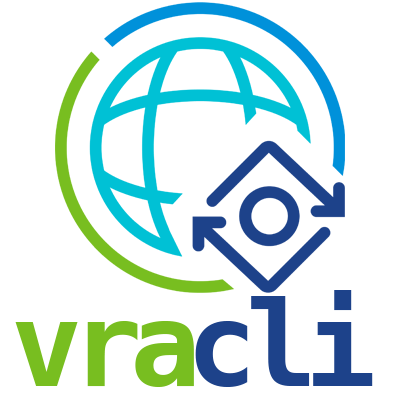

# vRealize Automation CLI (vra-cli)

 [](https://goreportcard.com/report/github.com/vmware/code-stream-cli)   [](https://flings.vmware.com/vrealize-automation-code-stream-cli)


The vRealize Automation CLI is a command line tool written in Go to interact with the vRealize Automation APIs. It is written to help automate vRealize Automation and provide a simple way to migrate content between vRA instances and projects.

* [Cloud Assembly](/docs/Cloud-Assembly)
* [Code Stream](/docs/Code-Stream.md)

## Installation

There are a few ways you can run `vra-cli` - install with [homebrew](https://brew.sh), download a pre-compiled binary, run the Docker container image, or build from Go source.

### Install using homebrew
MacOs and Linux users can install using homebrew
1) `brew tap sammcgeown/vra-cli`
2) `brew install vra-cli`

### Install the pre-compiled binary
1) Download the gzipped tar package from the [releases](releases/) page.
2) Extract the vra-cli binary, license and readme files
3) Move the vra-cli binary into the PATH for your OS

### Run the Docker image
1) Export environment variables (see below) for your repository
2) Pull the image `docker pull sammcgeown/vra-cli`
3) Run the container passing the environment variables to the image
`docker run -e VRA_SERVER="$VRA_SERVER" -e VRA_USERNAME="$VRA_USERNAME" -e VRA_PASSWORD="$VRA_PASSWORD" -e VRA_DOMAIN="$VRA_DOMAIN" sammcgeown/vra-cli get variable`


### Build from source
1) Clone the respository
2) Download the repository
3) Build the vra-cli binary using `go build -o vra-cli`


## Configuration

The configuration file stores the targets (vRA servers and credentials) that the CLI will use. By default vra-cli will use `$HOME/.vra-cli.yaml` as the config file. You can override this using the `--config` flag. The configuration file should be secured using file-level permissions to protect your credentials. 

```bash
# Use the default configuration file - $HOME/.vra-cli.yaml
vra-cli get variable
# Specify the configuration file
vra-cli --config /path/to/config.yaml get pipeline
```

Alternatively, you can use ENVIRONMENT variables to configure the CLI
```bash
VRA_SERVER="vra8-test-ga.cmbu.local"
VRA_USERNAME="test-user"
VRA_PASSWORD="VMware1!"
VRA_DOMAIN="cmbu.local"

vra-cli get execution
```

### Certificates
By default vra-cli will use the OS's certificate trust to determine whether the vRealize Automation Code Stream API certificate is trusted. To ignore certificate warnings, use the `--ignoreCertificateWarnings` flag:

```bash
❯ vra-cli get execution
WARN[0000] Get "https://wdc-fd-vra8-01.cmbu.local/pipeline/api/user-preferences": x509: certificate has expired or is not yet valid: current time 2021-05-18T13:21:44+01:00 is after 2020-10-17T16:06:34Z 
FATA[0001] Post "https://wdc-fd-vra8-01.cmbu.local/csp/gateway/am/api/login?access_token": x509: certificate has expired or is not yet valid: current time 2021-05-18T13:21:45+01:00 is after 2020-10-17T16:06:34Z 
exit status 1
❯ vra-cli get execution --ignoreCertificateWarnings
+--------------------------------------+--------------------------------+------------+-----------+-----------------------------------------+
|                  ID                  |              NAME              |  PROJECT   |  STATUS   |                 MESSAGE                 |
+--------------------------------------+--------------------------------+------------+-----------+-----------------------------------------+
| a86ae170-ef23-4d2a-8cfc-5de75767a78b | Packer-Template-Builds#44      | Field Demo | COMPLETED | Execution Completed.                    |
| f82eb2f8-0b5f-4b17-9053-4101a696ce08 | Packer-Template-Builds#27      | Field Demo | COMPLETED | Execution Completed.                    |
| 656cbe5e-84f7-4e2e-a6a5-60e0734a5a6a | Blue-Green Deployment#1        | Field Demo | CANCELED  | test-active-deployment.user-validation: |
|                                      |                                |            |           | Execution canceled by smcgeown.         |
| 0c0af1ca-5ec9-4aab-b027-311a1e483224 | TKG Workload Cluster#34        | Field Demo | FAILED    | Build.Install TKG CLI: Script           |
|                                      |                                |            |           | execution failed.                       |
| cc57d3d0-e38e-458b-8296-bfd75b4b9571 | Packer-Template-Builds#21      | Field Demo | COMPLETED | Execution Completed.                    |
| f1ccba1b-1018-4f1b-899b-12420973e9b2 | Install Ubuntu with            | Field Demo | COMPLETED | Execution Completed.                    |
|                                      | Software#20                    |            |           |                                         |
| 5924cdf8-756b-4412-87e9-242f40059ee3 | Field-Demo-Chat-App#5          | Field Demo | COMPLETED | Execution Completed.                    |
+--------------------------------------+--------------------------------+------------+-----------+-----------------------------------------+
```

### Debug
Use the `--debug` flag to enable debug logging.

### Working with targets

List available targets:
```
vra-cli config get-target
```

Add an target configuration:
```bash
vra-cli config set-target --config test-config.yaml --name my-vra-server --password mypassword --username myuser --domain mydomain.com --server my-vra-server.mydomain.com
# Outputs:
# Creating new target my-vra-server
# Use `vra-cli config use-target --name my-vra-server` to use this target
# {
#   "domain": "mydomain.com",
#   "password": "mypassword",
#   "server": "my-vra-server.mydomain.com",
#   "username": "myuser"
# }
```

```bash
#Set the active target
vra-cli config use-target --name my-vra-server --config test-config.yaml
#View the current active target
vra-cli config current-target --config test-config.yaml
```

[](https://asciinema.org/a/JLRJOYU2w0uSSlsBxYVB5GkqP)

## Shell Completions
Basic shell completion is now available using the `vra-cli completion` command - to load completions:

Bash:
```bash
  $ source <(vra-cli completion bash)

  # To load completions for each session, execute once:
  # Linux:
  $ vra-cli completion bash > /etc/bash_completion.d/vra-cli
  # macOS:
  $ vra-cli completion bash > /usr/local/etc/bash_completion.d/vra-cli
```
Zsh:
```zsh
  # If shell completion is not already enabled in your environment,
  # you will need to enable it.  You can execute the following once:

  $ echo "autoload -U compinit; compinit" >> ~/.zshrc

  # To load completions for each session, execute once:
  $ vra-cli completion zsh > "${fpath[1]}/_vra-cli"

  # You will need to start a new shell for this setup to take effect.
```
fish:
```fish
  $ vra-cli completion fish | source

  # To load completions for each session, execute once:
  $ vra-cli completion fish > ~/.config/fish/completions/vra-cli.fish
```
PowerShell:
```powershell
  PS> vra-cli completion powershell | Out-String | Invoke-Expression

  # To load completions for every new session, run:
  PS> vra-cli completion powershell > vra-cli.ps1
  # and source this file from your PowerShell profile.
```